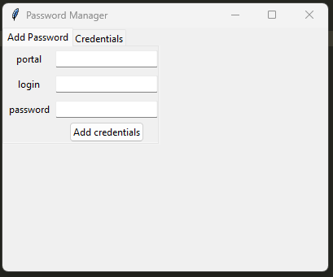
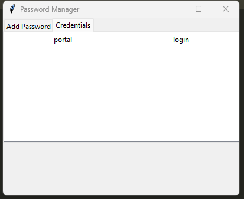
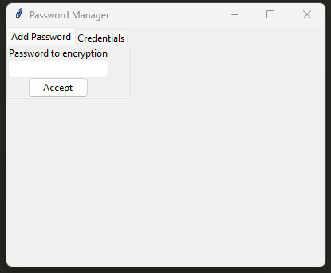

# Passwords_Manager

Passwords Manager

## Packages Used


* sqlalchemy
* cryptography
* python-dotenv


## Run application

```bash
$ git clone https://github.com/Kumor96/Passwords_Manager.git
$ cd Passwords_Manager
$ pip install -r requirements.txt
$ python main.py
```

<p></p>


